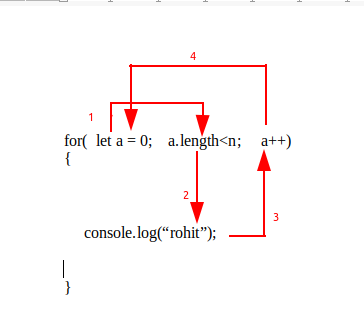

# For loop -

### Syntax -

    for( Initialization; condition; increment or decrement)
    {
        statement / task / programm
    }

### Example -

    for(let a = 0;  a.length<n; a++)
    {
        console.log(“rohit”);
    }
 
